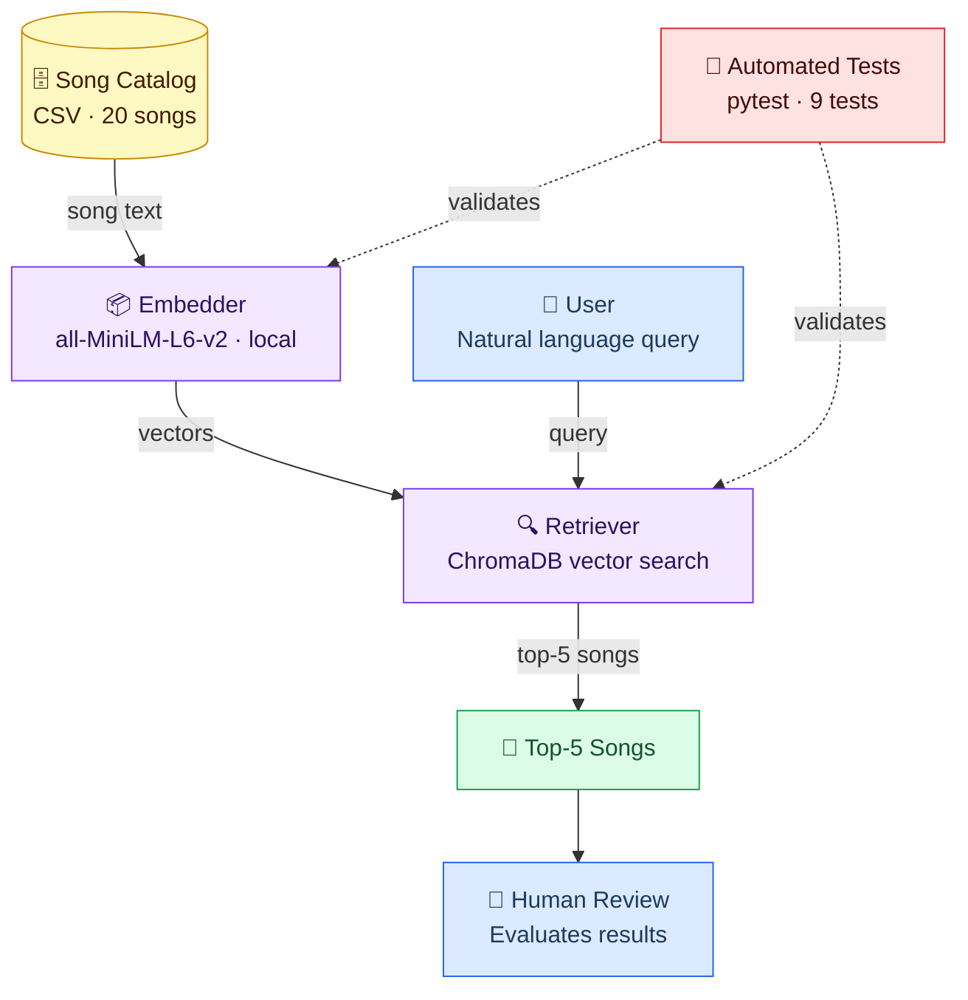

# Music Recommender — System Diagram

```mermaid
flowchart TD
    USER["👤 User\nNatural language query"]
    DATA[("🗄️ Song Catalog\nCSV · 20 songs")]
    EMBEDDER["📦 Embedder\nall-MiniLM-L6-v2 · local"]
    RETRIEVER["🔍 Retriever\nChromaDB vector search"]
    OUTPUT["🎵 Top-5 Songs"]
    TESTS["🧪 Automated Tests\npytest · 9 tests"]
    HUMAN["👤 Human Review\nEvaluates results"]

    DATA -->|"song text"| EMBEDDER
    EMBEDDER -->|"vectors"| RETRIEVER
    USER -->|"query"| RETRIEVER
    RETRIEVER -->|"top-5 songs"| OUTPUT
    OUTPUT --> HUMAN
    TESTS -.->|"validates"| EMBEDDER
    TESTS -.->|"validates"| RETRIEVER

    classDef user     fill:#dbeafe,stroke:#2563eb,color:#1e3a5f
    classDef data     fill:#fef9c3,stroke:#ca8a04,color:#451a03
    classDef process  fill:#f3e8ff,stroke:#7c3aed,color:#2e1065
    classDef output   fill:#dcfce7,stroke:#16a34a,color:#14532d
    classDef testing  fill:#fee2e2,stroke:#dc2626,color:#450a0a

    class USER,HUMAN user
    class DATA data
    class EMBEDDER,RETRIEVER process
    class OUTPUT output
    class TESTS testing
```
